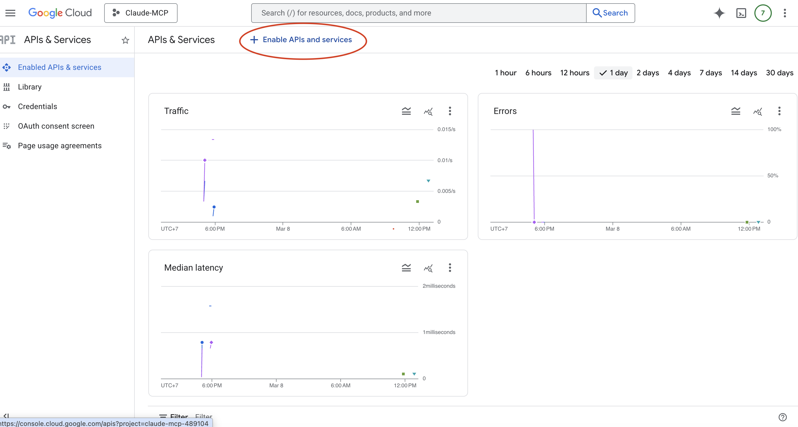
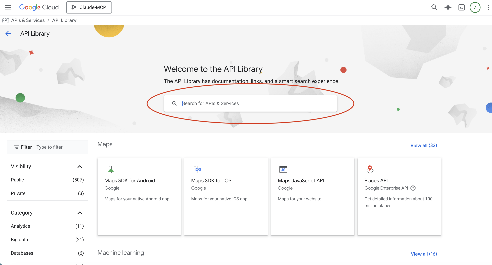
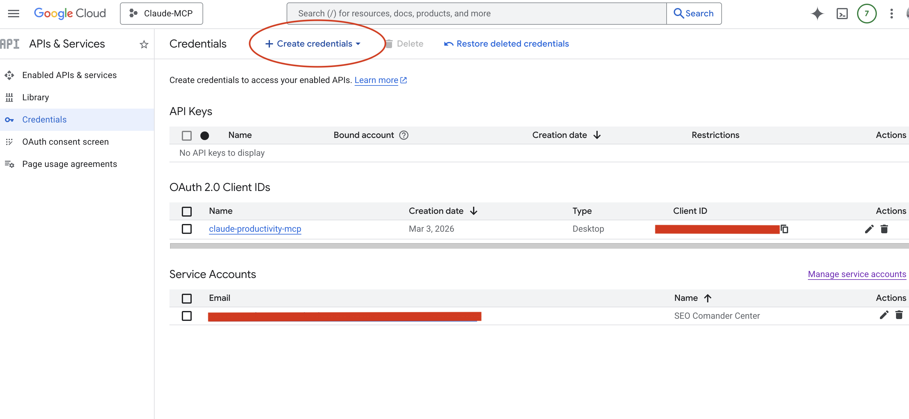
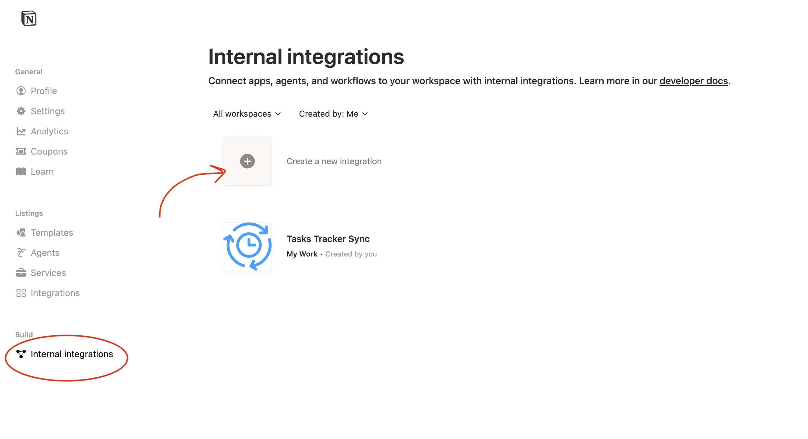
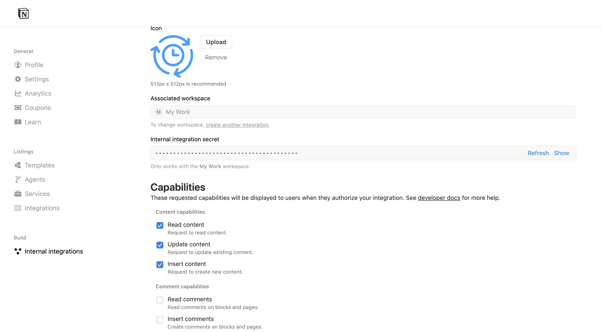
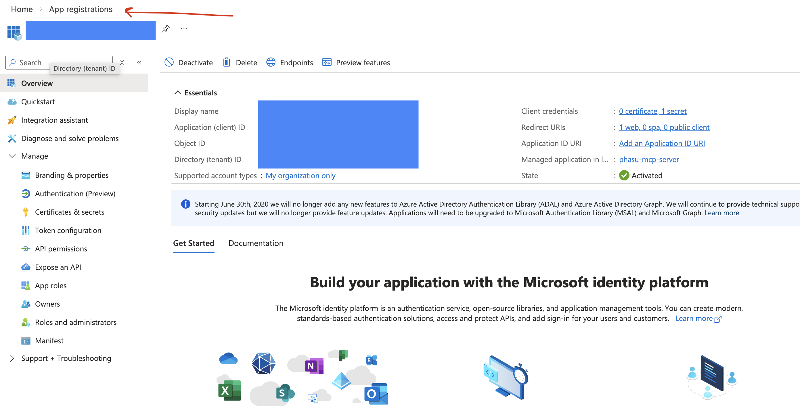
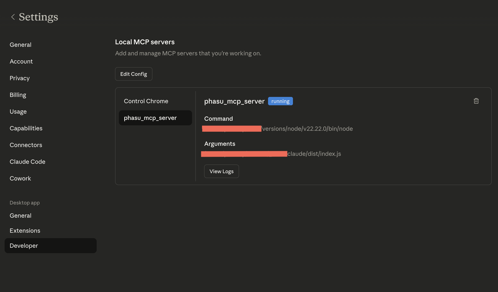

# claude-productivity-mcp

[🇹🇭 ภาษาไทย](README.md) | 🇬🇧 English

**MCP Server for Claude Desktop** that connects your favorite productivity tools in one place — Gmail, Google Calendar, Google Drive, Google Sheets, Notion, and Microsoft Outlook. Toggle services on/off via `.env` — no code changes required.

> Works with [Claude Desktop](https://claude.ai/download) via the [Model Context Protocol (MCP)](https://modelcontextprotocol.io)

---

## What is MCP?

**Model Context Protocol (MCP)** is an open standard that lets Claude Desktop connect directly to external tools and services. Instead of switching between apps, you can simply tell Claude:

- _"Summarize my unread emails from today"_
- _"Schedule a meeting tomorrow at 10am in my Calendar"_
- _"Find the proposal file in my Drive and tell me when it was last updated"_
- _"Append today's expense to my Google Sheets tracker"_

Claude will handle it instantly — no copy-pasting, no context switching.

---

## Supported Tools

### Google (Gmail + Calendar + Drive + Sheets)
| Tool | Description |
|------|-------------|
| `gmail_list_emails` | List emails with optional query filter |
| `gmail_get_email` | Read full email including body |
| `gmail_mark_as_read` | Mark email as read |
| `gmail_send_email` | Send a new email (CC supported) |
| `gmail_reply_email` | Reply within the same thread |
| `calendar_list_calendars` | List all calendars in your account |
| `calendar_list_events` | List events with date/query filter |
| `calendar_create_event` | Create a new event |
| `calendar_update_event` | Update an existing event |
| `calendar_cancel_event` | Cancel an event (safe patch — not permanent delete) |
| `drive_list_files` | List files in Drive |
| `drive_search` | Search files by name |
| `sheets_list_sheets` | List all sheets in a spreadsheet |
| `sheets_read` | Read data from a range |
| `sheets_write` | Write/update data in a range |
| `sheets_append` | Append new rows |

### Notion
| Tool | Description |
|------|-------------|
| `notion_list_timesheet` | List timesheet entries |
| `notion_add_timesheet` | Add a timesheet entry |
| `notion_update_timesheet` | Update a timesheet entry |
| `notion_export_excel` | Export timesheet to Excel |

### Microsoft Outlook
| Tool | Description |
|------|-------------|
| `outlook_list_emails` | List emails |
| `outlook_get_email` | Read full email |
| `outlook_mark_as_read` | Mark email as read |
| `outlook_send_email` | Send an email |

---

## Requirements

- [Node.js](https://nodejs.org) v18 or higher
- [Claude Desktop](https://claude.ai/download)
- Google account (for Gmail / Calendar / Drive / Sheets)
- Microsoft 365 account (for Outlook — optional)
- Notion account (for Notion — optional)

---

## Installation

```bash
# 1. Clone the repo
git clone https://github.com/kmusicman/claude-productivity-mcp.git
cd claude-productivity-mcp

# 2. Install dependencies
npm install

# 3. Copy config file
cp .env.example .env
```

---

## Setup

### 1. Google (Gmail + Calendar + Drive + Sheets)

#### 1.1 Enable Google APIs

1. Go to [Google Cloud Console](https://console.cloud.google.com)
2. Create a new project or select an existing one
3. Go to **APIs & Services → Library** and enable:
   - **Gmail API**
   - **Google Calendar API**
   - **Google Drive API**
   - **Google Sheets API**





#### 1.2 Create OAuth 2.0 Credentials

1. Go to **APIs & Services → Credentials**
2. Click **Create Credentials → OAuth client ID**
3. Select Application type: **Desktop app**
4. Name it anything and click **Create**
5. Click **Download JSON**
6. Rename the downloaded file to `oauth2.keys.json`
7. Place it at `credentials/oauth2.keys.json`



> If you haven't configured the OAuth consent screen yet, go to **APIs & Services → OAuth consent screen**, set it to External, and add your email as a Test user.

#### 1.3 Run Setup

```bash
npx tsx src/setup-google-auth.ts
```

A browser window will open → sign in with Google → grant permissions → the token will be saved automatically to `credentials/google-token.json`


---

### 2. Notion

#### 2.1 Create a Notion Integration

1. Go to [https://www.notion.so/my-integrations](https://www.notion.so/my-integrations)
2. Click **New integration**
3. Name it (e.g. `Claude MCP`) and select your workspace
4. Click **Submit**
5. Copy the **Internal Integration Token**





#### 2.2 Connect to a Database

1. Open the Notion database you want to use
2. Click **...** (top right) → **Connections** → select your integration
3. Copy the Database ID from the URL: `https://notion.so/YOUR_DATABASE_ID?v=...`

#### 2.3 Save Credentials

Create `credentials/notion.json`:

```json
{
  "apiKey": "ntn_YOUR_NOTION_API_KEY",
  "timesheetDatabaseId": "YOUR_DATABASE_ID"
}
```

---

### 3. Microsoft Outlook

#### 3.1 Create an Azure App Registration

1. Go to [Azure Portal](https://portal.azure.com)
2. Search for **App registrations** → **New registration**
3. Name it (e.g. `Claude MCP`)
4. Supported account types: **Personal Microsoft accounts only**
5. Redirect URI: `http://localhost:5555/oauth/callback` (Platform: Web)
6. Click **Register**



#### 3.2 Add API Permissions

1. Go to **API permissions → Add a permission → Microsoft Graph**
2. Select **Delegated permissions** and add:
   - `Mail.Read`
   - `Mail.ReadWrite`
   - `Mail.Send`
3. Click **Grant admin consent**

#### 3.3 Create a Client Secret

1. Go to **Certificates & secrets → New client secret**
2. Add a description and expiry → click **Add**
3. Copy the **Value** immediately (only shown once)

#### 3.4 Save Credentials

Create `credentials/ms365.keys.json`:

```json
{
  "clientId": "YOUR_AZURE_CLIENT_ID",
  "clientSecret": "YOUR_AZURE_CLIENT_SECRET",
  "tenantId": "consumers"
}
```

#### 3.5 Run Setup

```bash
npx tsx src/setup-outlook-auth.ts
```

---

### 4. Build

```bash
npm run build
```

---

## Connect to Claude Desktop

1. Open the Claude Desktop config file:
   - **macOS:** `~/Library/Application Support/Claude/claude_desktop_config.json`
   - **Windows:** `%APPDATA%\Claude\claude_desktop_config.json`

2. Add the following:

```json
{
  "mcpServers": {
    "productivity-mcp": {
      "command": "node",
      "args": ["/ABSOLUTE/PATH/TO/claude-productivity-mcp/dist/index.js"]
    }
  }
}
```

> Replace `/ABSOLUTE/PATH/TO/` with the actual path on your machine.

3. **Restart Claude Desktop**



---

## Configuration

Enable or disable each service in `.env`:

```env
ENABLE_GOOGLE=true    # Gmail + Calendar + Drive + Sheets
ENABLE_NOTION=true
ENABLE_OUTLOOK=true
```

Set to `true` to enable, `false` or remove to disable.

---

## Example Prompts

```
"Summarize my 5 latest unread emails in Gmail"

"Add a team meeting event tomorrow 10:00-11:00am in Google Calendar"

"Search for files containing 'proposal' in Google Drive"

"Read data from Sheet1 range A1:D10 in spreadsheet: [spreadsheet ID]"

"Send an email to someone@example.com with subject 'Hello' and body 'Test message'"
```

---

## License

MIT
